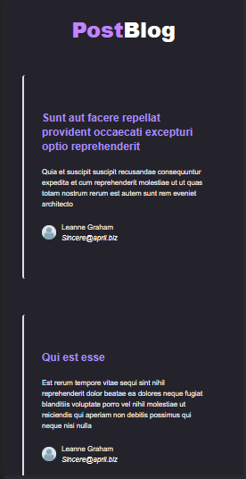
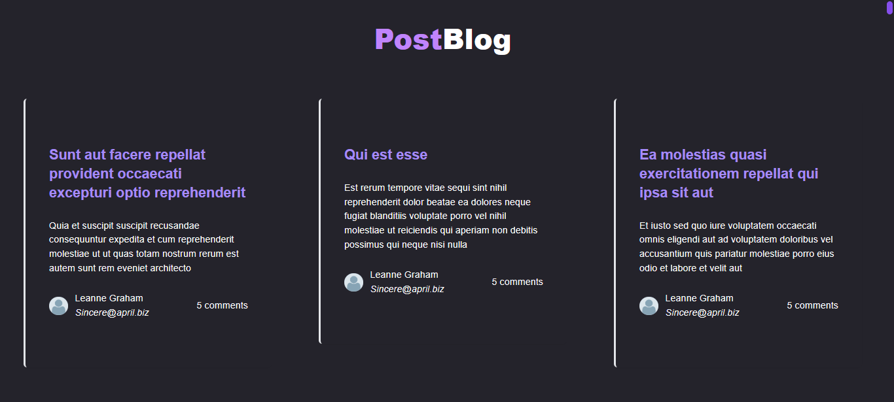
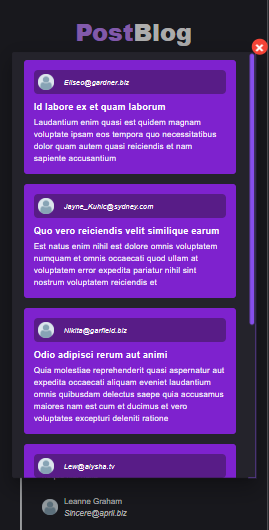
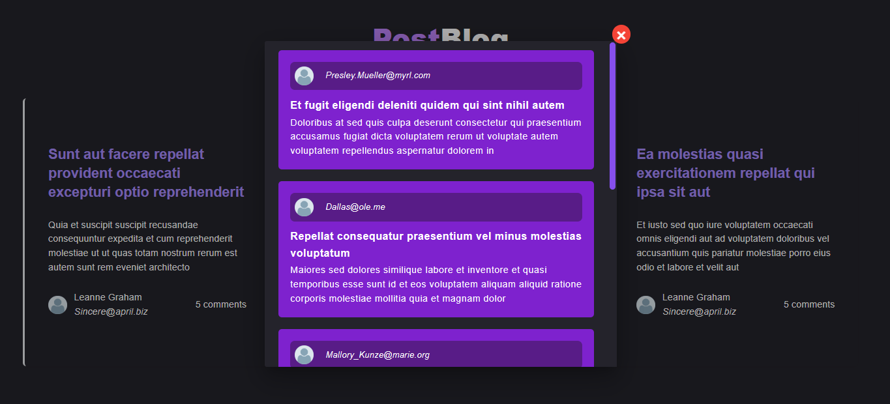

<h1 align="center">Desafio Post Blog</h1>

## 📸 Screenshots da aplicação:
<div>
  
  
  </br>
  
  
</div>

</br>
<p align="center">
  <a href="linkedin.com/in/wesley-emanuel-alves-de-oliveira-7b05781b9">Linkedin</a>&nbsp;&nbsp;&nbsp;|&nbsp;&nbsp;&nbsp;
  <a>Email: dev.wesleyalves@gmail.com</a>&nbsp;&nbsp;&nbsp;|&nbsp;&nbsp;&nbsp;
  <span>(85) 98514-1683</span>
</p> </br>

### 📝 Sobre o projeto:
O desafio era fazer o front-end para exibição de posts de um blog e ao clicar em um post, trazer os comentários associados.
A solução foi trazer cards dispostos na tela em colunas (fiz isso com o Grid do CSS) e ao clicar em cada post abrir um modal
com os seus comentários. Uma solução simples e de fácil usabilidade. Para esse desafio eu utilizei o Vue 3, além do framework 
TailwindCss para estilização e ajustes de resposividade. Além disso utilizei o Vuetify para facilitar a criação dos modals 
de comentários. Para conexão com a API utilizei o Axios.

## 💻 Tecnologias utilizadas:
- VueJs
- Javascript
- HTML
- CSS
- Tailwind CSS
- Vuetify
- Axios

## 🏃🏻‍♂️ Como executar o Projeto

### 🔧 Instalando as Dependências:
```
npm install
```

### 🔥 Executar a aplicação VueJs em ambiente de desenvolvimento:

```sh
npm run dev
```

